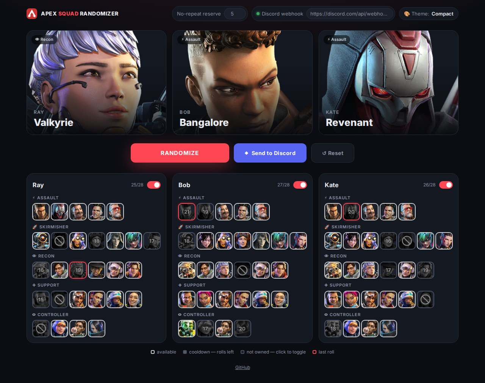
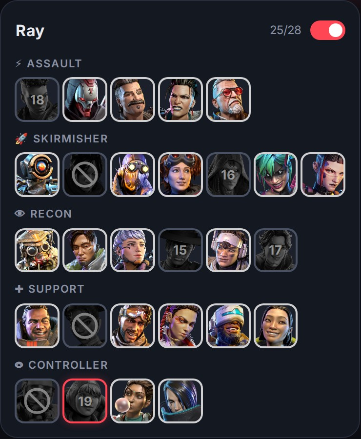
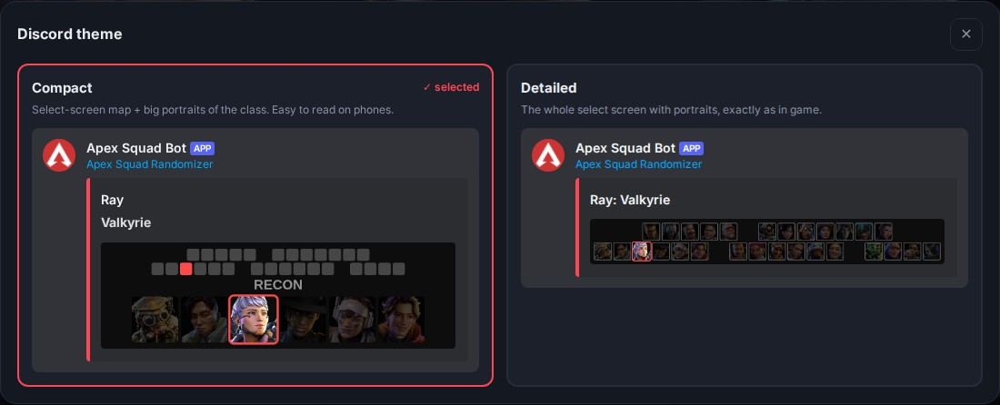
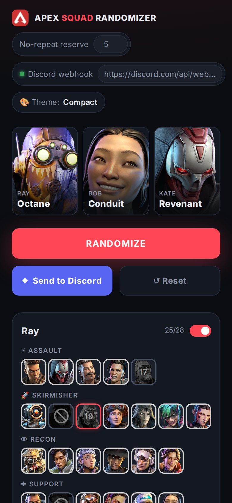

# Apex Legends Squad Randomizer

Rolls a random legend for every player in your Apex Legends squad and posts the result to Discord —
with a picture of the legend select screen, so everyone knows where to click.

**▶ Open the randomizer: https://rayderua.github.io/apex-legends-squad-randomizer/**



No build step, no backend, no dependencies — a static page that runs entirely in the browser.

## How to use

1. **Set up once:** name the players, untick the legends each player doesn't own,
   paste a Discord webhook and pick a theme.
2. **Every match:** press **Randomize** → **Send to Discord**.

Everything is saved in the browser, so next time the page opens ready to go.

## Features

- **Up to 3 players** — rename a player right in the card header; the switch includes or excludes them.
- **Per-player legend pool** — click a portrait to mark a legend as not owned (or not wanted).
- **No duplicates in a squad** — two players never get the same legend.
- **No-repeat window** — a player won't get the same legend again too soon ([how it works](#no-repeat-window)).
- **Discord webhook** — one click sends the squad with an image of the select screen; two themes to choose from.
- **↺ Reset** — clears the current squad and the cooldowns; players, legends and settings stay.
- **Works on phones** — the layout adapts to small screens.
- **Saved locally** — names, players, legend pools, reserve, roll history, webhook and theme live in `localStorage`.

### Legend tiles



Every portrait in a player card shows its state:

| Look | Meaning |
|------|---------|
| colour, **white** ring | available for the next roll |
| grey, number, **grey** ring | rolled recently — the number is how many rolls until it's back |
| dark, "no entry" sign, **grey** ring | the player doesn't own it — click to toggle |
| **red** ring | rolled in the last roll |

Hover a portrait to see a hint.

<br clear="right">

## No-repeat window

Each player has their own roll history. With **N** legends in a player's pool and a
**No-repeat reserve** of **R**, any **N − R** rolls in a row for that player are different legends.

| Legends in pool (N) | Reserve (R) | Different legends in a row |
|---------------------|-------------|----------------------------|
| 13                  | 5           | 8                          |
| 28 (all)            | 5           | 23                         |
| 10                  | 8           | 2                          |
| ≤ R + 1             | any         | no restriction             |

- The reserve is the number of legends that always stay available: higher means more random,
  lower means more rotation. Change it in the top bar.
- Unticking a legend doesn't break the guarantee — only legends currently in the pool are counted.
- **↺ Reset** clears the history for all players.

## Discord

1. In Discord: *Server Settings → Integrations → Webhooks → New Webhook*, choose a channel, *Copy Webhook URL*.
2. Paste it into the **Discord webhook** field in the top bar — the dot turns green.
3. Press **🎨 Theme** and click the look you like.
4. Roll a squad and press **Send to Discord** — it's sent right away.



The theme window shows how each theme looks in Discord, with the same images and sizes,
using your last roll (or a sample legend).

| Theme | Card text | Image |
|-------|-----------|-------|
| **Compact** | player name, legend in bold | schematic of the select screen with the legend's slot in red + its class with large portraits |
| **Detailed** | `Player: Legend` | the whole select screen with portraits, the legend highlighted |

Discord shrinks images in messages to about 400px wide, so *Compact* is easier to read on phones,
while *Detailed* shows the exact in-game layout.

**Notes**

- Images are generated in the browser. When the page is opened as a local file (`file://`), browsers block
  this and the message is sent as text only — use GitHub Pages or a local server
  (`python -m http.server` in the project folder).
- The webhook URL is stored only in your browser, but anyone who has it can post to the channel —
  don't share it.
- The select-screen images follow `CONFIG.classes` and `CONFIG.selectScreenRows` in `static/js/app.js`.
  If a new season changes the in-game order, update them so the highlight points to the right slot.

## On a phone



## Project structure

```
index.html            page shell — the UI itself is rendered by app.js
static/js/app.js      everything else: config, state, randomizer, UI, Discord
static/css/style.css  styles
static/images/        legend portraits (Portrait_<Name>_square.png) and the app icon
docs/screenshots/     images for this README
```

## Adding a new legend

1. Add the name to the right class in `CONFIG.classes` at the top of `static/js/app.js`
   (in the same order as on the in-game select screen).
2. Put a square portrait into `static/images/` named `Portrait_<Name>_square.png`
   (spaces become underscores: `Mad Maggie` → `Portrait_Mad_Maggie_square.png`).

New legends are enabled for every player automatically.

## Deployment

Push to GitHub and enable *Settings → Pages → Deploy from a branch → `main` / root*.
The site is published at https://rayderua.github.io/apex-legends-squad-randomizer/

JS and CSS are loaded with a unique `?v=` parameter on every page load, so a new release is picked up
immediately — no need to rename files. Only `index.html` itself may be cached by GitHub Pages for a few minutes.

## License

No license specified yet.
